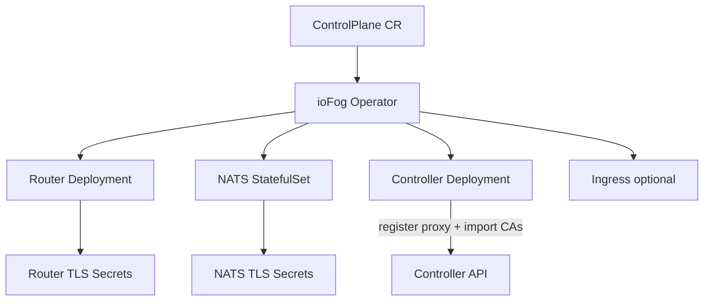

# ControlPlane documentation

This folder documents the **ControlPlane** custom resource (CR) used by the ioFog / Datasance PoT operator to deploy and manage a control plane: **Controller**, **Router** (Skupper-based interior router), and **NATS** hub (JetStream).

These guides match the operator in this repository (v3.8 greenfield and later, including v3.9.x).

## Documents

| Document | Description |
|----------|-------------|
| [How the operator works](./operator.md) | Process, status machine, and the Controller reconcile path (Deployment, Secrets, login, router and NATS registration) |
| [ControlPlane CRD reference](./controlplane-crd.md) | Full `spec` and `status` field reference, operator defaults, Kubernetes objects created, reconcile lifecycle, and CR field → environment variable mapping |
| [Router and NATS](./router-and-nats.md) | How the operator builds the Router Deployment and NATS StatefulSet, certificates, `skrouterd.json` / `server.conf`, and Controller API registration (default router and NATS hub) |
| [Securing the cluster](./securing-cluster.md) | HTTPS for the Controller (TLS Secret vs Ingress), Router and NATS TLS/CA generation, bring-your-own CA, CA import into the Controller, cert-manager examples, and edge trust |

## API group (mirror flavor)

The Go types and CRD schema are identical; only the **API group** on the CR differs by build flavor:

| Mirror | `apiVersion` on the CR |
|--------|-------------------------|
| Eclipse ioFog | `iofog.org/v3` |
| Datasance PoT | `datasance.com/v3` |

Replace the group in examples below if you use the other mirror. `kind: ControlPlane` and `spec` fields are the same.

## Quick orientation

## Which TLS pattern should I use?

| Goal | Typical setup | See |
|------|----------------|-----|
| Public Controller API over HTTPS on a cloud LoadBalancer | `services.controller.type: LoadBalancer`, `controller.https: true`, TLS Secret on the pod | [Securing — Pattern A](./securing-cluster.md#pattern-a-loadbalancer--pod-tls) |
| HTTPS via an ingress controller (cert-manager, nginx, etc.) | `services.controller.type: ClusterIP`, `ingresses.controller.host` + TLS Secret on Ingress | [Securing — Pattern B](./securing-cluster.md#pattern-b-clusterip--ingress-tls) |
| Router / NATS mTLS for messaging | Operator-generated or pre-created Secrets in the ControlPlane namespace | [Router and NATS](./router-and-nats.md) and [Securing — Router TLS](./securing-cluster.md#router-tls-secrets) |

## Sample manifests in this repo

- [`config/cr/controlplane.yaml`](../../config/cr/controlplane.yaml) — annotated sample CR
- [`config/cr/local/controlplane.yaml`](../../config/cr/local/controlplane.yaml) — local development
- [`apis/controlplanes/v3/testdata/controlplane-ref.yaml`](../../apis/controlplanes/v3/testdata/controlplane-ref.yaml) — reference used in tests

## Related reading

- [Operator README](../../README.md) — install, mirrors, greenfield v3.8 notes
- Controller env mapping (upstream): `Controller/src/config/env-mapping.js` (operator maps CR → those variables)
