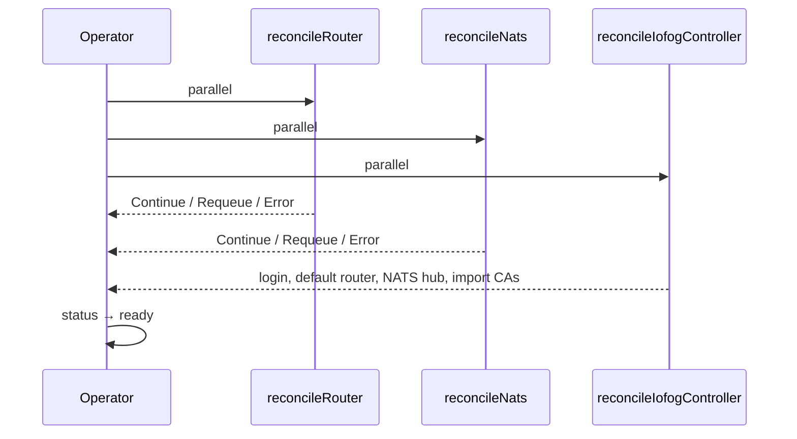

# ControlPlane CRD reference

The **ControlPlane** resource declares the desired state of an ioFog / Datasance PoT **control plane** in a Kubernetes namespace. The operator reconciles it into Deployments, a NATS StatefulSet, Services, optional Ingress, Secrets, ConfigMaps, PVCs, and RBAC.

## Resource overview

| Property | Value |
|----------|--------|
| **Kind** | `ControlPlane` |
| **API version** | `datasance.com/v3` or `iofog.org/v3` (mirror-specific) |
| **Scope** | Namespaced |
| **Subresources** | `status` |
| **Controller** | ioFog operator (`ControlPlaneReconciler`) |

Each ControlPlane instance is identified by `metadata.name` (referred to as the **instance name**). That name is used in labels (`app.kubernetes.io/instance`) and in derived resource names (for example JetStream key secret `nats-jetstream-key-<name>`).

## Status and lifecycle

### Conditions

`status.conditions` holds a single “active” condition type at a time (others are set to `False` when transitioning):

| Type | Meaning |
|------|---------|
| `deploying` | Initial rollout or recovery from an invalid state |
| `updating` | `spec` changed (`ObservedGeneration` on the previous condition does not match current generation) |
| `ready` | Control plane components reconciled successfully |

The narrative of the process, watches, and Controller reconcile steps is in [How the operator works](./operator.md). The operator reads the active condition to choose a reconcile path:

- **`deploying` / `updating`**: Run Router, NATS (if enabled), and Controller reconcilers **in parallel**. When all complete without blocking errors, transition to **`ready`**.
- **`ready`**: No further work (until the next spec change moves the CR back to `updating`).

New ControlPlane objects typically start with `status.conditions[0].type: deploying` and `status: "True"` (see sample CRs).

### Reconcile flow (deploying / updating)



**Controller reconcile** (after Deployment exists) additionally:

1. Resolves bootstrap password (`auth.bootstrap` or `passwordSecretRef`).
2. Waits for external access (LoadBalancer IP or Ingress LB status).
3. Logs into the Controller API (embedded bootstrap or external OAuth2).
4. Registers the **default router** (`PUT` default router with host/ports from LB or `ingresses.router`).
5. Registers the **default NATS hub** when NATS is enabled and an address is known.
6. **Imports** Router and NATS CA Secrets into the Controller certificate store (`CreateCA`, type `k8s-secret`).

**Router reconcile** requires an external **address** before TLS Secrets are generated:

- `services.router.type: LoadBalancer` → wait for LB hostname/IP on Service `router`.
- Otherwise → `ingresses.router.address` must be set.

**NATS reconcile** is skipped when `spec.nats.enabled: false`. When enabled, it bootstraps JWT/creds from the Controller API, ensures JetStream key and TLS Secrets, then creates the StatefulSet.

---

## `spec` reference

### Top-level fields

| Field | Required | Description |
|-------|----------|-------------|
| `auth` | **Yes** | Controller OIDC: `embedded` or `external` |
| `database` | **Yes** | PostgreSQL/MySQL/etc. or empty host for embedded SQLite |
| `ingresses` | No | External hostnames/ports for Ingress-based exposure |
| `services` | No | Kubernetes Service types and annotations |
| `replicas` | No | Controller and NATS replica counts |
| `images` | No | Container images and pull Secret |
| `controller` | No | Controller runtime URLs, HTTPS, logging |
| `events` | No | Audit event settings |
| `nats` | No | NATS hub toggle and JetStream storage |
| `vault` | No | Optional secrets vault integration for the Controller |

---

### `spec.auth`

Configures Controller authentication (v3.8+ embedded OIDC or external IdP). **No Keycloak** fields.

| Field | Type | Default / notes |
|-------|------|-----------------|
| `mode` | `embedded` \| `external` | **Required** |
| `insecureAllowHttp` | bool | If set, env `AUTH_INSECURE_ALLOW_HTTP` |
| `insecureAllowBootstrapLog` | bool | If set, env `AUTH_INSECURE_ALLOW_BOOTSTRAP_LOG` (dev only) |
| `bootstrap` | object | Embedded mode: admin bootstrap user/password |
| `bootstrap.username` | string | → Secret + `OIDC_BOOTSTRAP_ADMIN_USERNAME` |
| `bootstrap.password` | string | Inline password (stored in operator Secret) |
| `bootstrap.passwordSecretRef` | SecretKeySelector | Preferred for production; resolved at reconcile |
| `issuerUrl` | string | **External mode**: OIDC issuer URL |
| `client.id` / `client.secret` | string | OAuth2 client for Controller API |
| `consoleClient` | string | Embedded: EdgeOps Console OIDC client id → `OIDC_CONSOLE_CLIENT_ID` |
| `consoleClientEnabled` | bool | → `AUTH_CONSOLE_CLIENT_ENABLED` |
| `rateLimit.*` | | → `AUTH_RATE_LIMIT_*` env vars when set |
| `sessionStore.*` | | → `AUTH_SESSION_STORE_*`, `AUTH_SESSION_SECRET` |
| `tokenTtl.*` | | → `AUTH_ACCESS_TOKEN_TTL_SECONDS`, `AUTH_REFRESH_TOKEN_TTL_SECONDS` |
| `oidcTtl.*` | | → `AUTH_OIDC_*_TTL_SECONDS` |

**Operator behavior**

- Creates/updates Secret `controller-auth-credentials` (opaque) with keys such as `auth-mode`, `auth-bootstrap-username`, `auth-bootstrap-password`, `auth-issuer-url`, `auth-client-id`, `auth-client-secret`.
- DB/auth Secret changes can trigger a **controller pod restart**.
- Embedded login for operator API calls uses bootstrap credentials; external mode uses client credentials (see operator auth package).

**Embedded vs external**

| Mode | Operator API login |
|------|---------------------|
| `embedded` | Bootstrap user login |
| `external` | OAuth2 `client_credentials` with `client.id` / `client.secret` |

---

### `spec.database`

| Field | Type | Operator behavior |
|-------|------|-------------------|
| `provider` | string | Env `DB_PROVIDER` on Controller |
| `host` | string | Empty → **embedded SQLite** with PVC `controller-sqlite`, Deployment strategy **Recreate** |
| `port` | int | Stored in `controller-db-credentials` |
| `user` | string | Secret key `username` → `DB_USERNAME` |
| `password` | string | Secret key `password` → `DB_PASSWORD` |
| `databaseName` | string | Secret key `dbname` → `DB_NAME` |
| `ssl` | bool | Secret key `ssl` → env `DB_USE_SSL`; string **`false`** if omitted |
| `ca` | string | See [Database TLS and `ca`](#database-tls-and-ca) below |

Secret **`controller-db-credentials`** is created once; existing Secret is **not overwritten** on later reconciles (operator skips update unless the DB reconcile path updates it).

#### Database TLS and `ca`

Use these fields when the Controller connects to PostgreSQL, MySQL, or another external DB over **TLS**, especially when the server certificate is signed by a **private CA** or a CA that is not in the Controller image’s default trust store (managed cloud databases with custom roots, internal PKI, etc.).

| Field | Purpose |
|-------|---------|
| `ssl` | Enable TLS for the DB connection. Maps to Controller env **`DB_USE_SSL`** (`true` / `false`). |
| `ca` | Trust anchor for verifying the DB server certificate. Maps to Controller env **`DB_SSL_CA`**. |

**Format of `ca`:** a **base64-encoded string** of the CA certificate in **PEM** form (not raw multiline PEM in the CR). The Controller decodes this value and uses it when opening the DB connection. Typical input is the contents of your CA file, encoded as one line:

```bash
# Linux
base64 -w0 < db-ca.pem

# macOS
base64 -i db-ca.pem | tr -d '\n'
```

Paste the output into `spec.database.ca` in the ControlPlane manifest.

**Operator behavior:** the operator does **not** decode or validate `ca`. It copies the string verbatim into Secret `controller-db-credentials` (key `ca`), and the Controller pod reads it via **`DB_SSL_CA`**. If `ca` is omitted, the Secret key is empty and `DB_SSL_CA` is unset (empty).

**When to set `ca`:**

- Set **`ssl: true`** and provide **`ca`** when the DB uses TLS and you must trust a **custom / private CA**.
- You may use **`ssl: true`** without **`ca`** only if your Controller and DB driver can validate the server cert using built-in public CAs (depends on your DB endpoint and Controller version).
- Omit both (or leave `ssl` false) for non-TLS DB connections.

Example:

```yaml
database:
  provider: postgres
  host: postgres.internal.example.com
  port: 5432
  user: controller
  password: changeme
  databaseName: controller
  ssl: true
  ca: LS0tLS1CRUdJTiBDRVJUSUZJQ0FURS0t...  # base64(PEM of your DB CA)
```

This is **unrelated** to Router, NATS, or Controller API TLS Secrets; see [Securing the cluster — Database TLS](./securing-cluster.md#database-tls-specdatabaseca).

---

### `spec.replicas`

| Field | Default | Operator behavior |
|-------|---------|-------------------|
| `controller` | **1** if `0` or omitted | Controller Deployment `replicas` |
| `nats` | **2** minimum | If `< 2`, forced to **2**. CRD validation: minimum 2 when set |

**Note:** Controller replicas &gt; 1 require an **external database** (`database.host` set). With SQLite, use a single controller replica.

---

### `spec.images`

| Field | Default | Notes |
|-------|---------|-------|
| `pullSecret` | none | Pod `imagePullSecrets` |
| `controller` | Operator build default (`GetControllerImage()`) | Set at link time (`repo/controller:tag`) |
| `router` | `GetRouterImage()` | Also `ROUTER_IMAGE_1`…`4` on Controller |
| `nats` | `GetNatsImage()` on NATS pod; overridable | Also `NATS_IMAGE_1`…`4` on Controller when NATS enabled |

---

### `spec.services`

Each entry is a `Service` block: `type`, `address`, `annotations`, `externalTrafficPolicy`.

| Component | Field | Default type | Notes |
|-----------|-------|--------------|-------|
| `controller` | `services.controller` | **LoadBalancer** | `address` → `loadBalancerIP` when set |
| `router` | `services.router` | **LoadBalancer** | Must have LB or `ingresses.router.address` |
| `nats` | `services.nats` | **LoadBalancer** if omitted in reconcile | Client-facing ports (cluster, leaf, mqtt) |
| `natsServer` | `services.natsServer` | **LoadBalancer** if omitted | Service `nats-server` (client + monitor only) |

**External traffic policy** (`externalTrafficPolicy`):

- Only applied for `LoadBalancer` and `NodePort`.
- If omitted: **LoadBalancer → Local**, **NodePort → Cluster**, **ClusterIP → unset**.

**Ingress trigger for Controller:** when `services.controller.type` is **`ClusterIP`** and `ingresses.controller.host` is non-empty, the operator creates Ingress resource **`controller`**.

---

### `spec.ingresses`

| Block | Purpose |
|-------|---------|
| `ingresses.controller` | Host, TLS Secret name, class, annotations for Ingress `controller` |
| `ingresses.router` | External router hostname and ports when not using Router LoadBalancer |
| `ingresses.nats` | External NATS hostname and ports for hub registration and TLS SANs |

#### `ingresses.controller`

| Field | Operator use |
|-------|----------------|
| `host` | Ingress rule host; used to derive `CONTROLLER_PUBLIC_URL` / `CONSOLE_URL` when unset |
| `secretName` | Ingress `spec.tls[].secretName` |
| `ingressClassName` | Ingress class |
| `annotations` | Ingress metadata annotations (e.g. cert-manager, nginx) |

#### `ingresses.router`

| Field | Default if `0` / omitted in API registration |
|-------|-----------------------------------------------|
| `address` | Required when Router Service is not LoadBalancer |
| `messagePort` | **5671** |
| `interiorPort` | **55671** |
| `edgePort` | **45671** |

#### `ingresses.nats`

Used when NATS is not exposed via `services.nats` LoadBalancer. Ports default to **4222**, **6222**, **7422**, **8883**, **8222** (see types comment and `createDefaultNatsHub`).

---

### `spec.controller`

| Field | Default | Operator behavior |
|-------|---------|-------------------|
| `publicUrl` | Derived if empty | See [URL resolution](#url-resolution-publicurl-and-consoleurl) |
| `trustProxy` | Auto **`true`** when Ingress mode | Env `TRUST_PROXY` |
| `consoleUrl` | Defaults to `publicUrl` when empty | Env `CONSOLE_URL` |
| `consolePort` | **8008** | Container port; Service maps port **80** → `consolePort` |
| `pidBaseDir` | **`/home/runner`** | Env `PID_BASE` |
| `ecn` | empty | Env `ECN_NAME` |
| `https` | **false** if nil | Enables pod TLS mount and HTTPS readiness probe |
| `secretName` | — | **Required for pod TLS**: Kubernetes TLS Secret mounted at `/etc/iofog/controller-cert/` |
| `logLevel` | **`info`** | Env `LOG_LEVEL` |

**API port:** Controller listens on **51121** (`controller-api` Service port). Console Service exposes **80 → consolePort**.

---

### `spec.events`

If **no** event field is set, the operator does **not** set `EVENT_*` env vars.

If any of `auditEnabled`, `captureIpAddress`, `retentionDays`, or `cleanupInterval` is set:

| Field | Env var |
|-------|---------|
| `auditEnabled` | `EVENT_AUDIT_ENABLED` (always set when block is active) |
| `retentionDays` | `EVENT_RETENTION_DAYS` (if audit enabled and non-zero) |
| `cleanupInterval` | `EVENT_CLEANUP_INTERVAL` (if audit enabled and non-zero) |
| `captureIpAddress` | `EVENT_CAPTURE_IP_ADDRESS` when pointer set |

---

### `spec.nats`

| Field | Default | Behavior |
|-------|---------|----------|
| *(block omitted)* | NATS **enabled** | |
| `enabled` | **true** if omitted | `false` → no NATS resources, no hub registration |
| `jetStream.storageSize` | **10Gi** PVC, **10G** in `server.conf` | |
| `jetStream.memoryStoreSize` | **1G** in `server.conf` | |
| `jetStream.storageClassName` | cluster default | Optional PVC `storageClassName` |

**NATS Kubernetes names:** StatefulSet `nats`, headless Service `nats-headless`, Services `nats` and `nats-server`, ConfigMaps `iofog-nats-config`, `iofog-nats-jwt-bundle`.

---

### `spec.vault`

Optional Controller secrets vault. Block is active when `vault` is non-nil and `provider` or a provider block (`hashicorp`, `aws`, `azure`, `google`) is set.

| Field | Env / Secret |
|-------|----------------|
| `enabled` | `VAULT_ENABLED` (default **true** when vault block active and pointer nil) |
| `provider` | `VAULT_PROVIDER` |
| `basePath` | `VAULT_BASE_PATH` with `$namespace` replaced by ControlPlane namespace |
| Provider blocks | Stored in Secret `controller-vault-credentials`; env `VAULT_HASHICORP_*`, `VAULT_AWS_*`, etc. |

Supported provider strings (documented on type): `hashicorp`, `openbao`, `vault`, `aws`, `aws-secrets-manager`, `azure`, `azure-key-vault`, `google`, `google-secret-manager`.

---

## URL resolution (`publicUrl` and `consoleUrl`)

Logic in `resolveControllerAccess`:

1. If `controller.publicUrl` is set and `consoleUrl` is empty → `consoleUrl = publicUrl`.
2. **Ingress mode** (`ClusterIP` + `ingresses.controller.host`):
   - If `publicUrl` empty → `https://<host>` or `http://<host>` (see scheme rules below).
   - If `trustProxy` unset → operator sets **`trustProxy: true`** on the Deployment env.
3. **LoadBalancer mode** (default Service type, empty `publicUrl`):
   - Waits for LB IP/hostname.
   - Sets `publicUrl` to `{scheme}://{lb}:{51121}` and `consoleUrl` to `{scheme}://{lb}`.

**Scheme for derived URLs**

| Condition | Scheme |
|-----------|--------|
| `controller.https: true` | `https` |
| Ingress mode and `ingresses.controller.secretName` set | `https` (even if pod speaks HTTP) |
| Otherwise | `http` |

---

## Kubernetes objects created

All namespaced objects use standard labels:

- `app.kubernetes.io/name: iofog`
- `app.kubernetes.io/instance: <ControlPlane.metadata.name>`
- `app.kubernetes.io/component: controller | router | nats`
- `app.kubernetes.io/managed-by: iofog-operator`

| Component | Kind | Name(s) |
|-----------|------|---------|
| Controller | Deployment | `controller` |
| Controller | Service | `controller` |
| Controller | Ingress | `controller` (ClusterIP + ingress host only) |
| Controller | PVC | `controller-sqlite` (empty DB host only) |
| Router | Deployment | `router` (HA secondary `router-2` not enabled in CR today) |
| Router | Service | `router` |
| Router | ConfigMap | router Skupper config |
| NATS | StatefulSet | `nats` |
| NATS | Service | `nats-headless`, `nats`, `nats-server` |
| NATS | ConfigMap | `iofog-nats-config`, `iofog-nats-jwt-bundle` |
| Each | ServiceAccount, Role, RoleBinding | per microservice |

Owner references: Secrets, Deployments, Services, Ingress, etc. are owned by the ControlPlane CR for garbage collection.

---

## Operator-managed Secrets (non-TLS)

| Secret name | Created by | Update policy |
|-------------|------------|---------------|
| `controller-db-credentials` | Controller microservice | DB reconcile may update; triggers restart |
| `controller-auth-credentials` | Controller microservice | Auth reconcile may update; triggers restart |
| `controller-vault-credentials` | When `spec.vault` configured | Vault reconcile may update; triggers restart |
| `nats-operator-seed`, `nats-system-account-seed`, `nats-creds-sys-admin-hub` | NATS bootstrap from Controller API | Create/update on NATS reconcile |
| `nats-jetstream-key-<instance>` | NATS JetStream encryption | Ensured at NATS reconcile |

TLS Secrets for Router/NATS/Controller are described in [Securing the cluster](./securing-cluster.md). Workload layout, config files, and Controller registration are in [Router and NATS](./router-and-nats.md).

---

## CR field → Controller environment variables

The operator maps the CR into the Controller container environment (see `newControllerMicroservice`, `appendControllerAuthEnv`, `appendControllerServerEnv`).

### Always (when field applies)

| CR / source | Environment variable |
|-------------|----------------------|
| `database.provider` | `DB_PROVIDER` |
| `database` (Secret keys) | `DB_NAME`, `DB_USERNAME`, `DB_PASSWORD`, `DB_HOST`, `DB_PORT`, `DB_USE_SSL`, `DB_SSL_CA` (from Secret `controller-db-credentials`) |
| `database.ssl` | `DB_USE_SSL` — `"true"` / `"false"` |
| `database.ca` | `DB_SSL_CA` — **base64-encoded PEM** passed through unchanged; Controller decodes for DB TLS trust |
| — | `CONTROL_PLANE=Kubernetes` |
| `metadata.name` | `CONTROLLER_NAME` |
| namespace | `CONTROLLER_NAMESPACE` |
| `images.router` | `ROUTER_IMAGE_1` … `ROUTER_IMAGE_4` |
| NATS enabled | `NATS_ENABLED` |
| `images.nats` | `NATS_IMAGE_1` … `NATS_IMAGE_4` |
| `controller.ecn` | `ECN_NAME` |
| `controller.pidBaseDir` | `PID_BASE` |
| `controller.logLevel` | `LOG_LEVEL` |
| Resolved URLs | `CONTROLLER_PUBLIC_URL`, `CONSOLE_URL`, `CONSOLE_PORT`, `TRUST_PROXY` |
| `auth.*` | See auth table above |
| `events.*` | `EVENT_*` when events block active |
| `vault.*` | `VAULT_*` and provider-specific vars |
| `controller.https: true` | `SERVER_DEV_MODE=false`, `TLS_PATH_CERT`, `TLS_PATH_KEY`, `TLS_PATH_INTERMEDIATE_CERT` |

### Router fixed ports (registered with Controller, not CR fields)

| Port | Value |
|------|-------|
| Messaging (TLS) | 5671 |
| HTTP (metrics) | 9090 |
| Inter-router | 55671 |
| Edge | 45671 |

---

## CR field → NATS configuration

| CR field | Effect |
|----------|--------|
| `replicas.nats` | StatefulSet replicas (min 2) |
| `nats.jetStream.storageSize` | PVC size + `max_file_store` in `server.conf` |
| `nats.jetStream.memoryStoreSize` | `max_memory_store` |
| `nats.jetStream.storageClassName` | PVC `storageClassName` |
| `services.nats` / `services.natsServer` | Service types and annotations |
| `ingresses.nats` / NATS LB address | Hub registration + TLS certificate SANs |

NATS container env (excerpt): `NATS_TLS_DIR=/etc/nats/certs`, certs from Secrets `nats-site-server`, `nats-mqtt-server`.

---

## Validation and operational constraints

1. **Router exposure:** LoadBalancer **or** `ingresses.router.address` required.
2. **Controller Ingress:** Requires `services.controller.type: ClusterIP` and `ingresses.controller.host`.
3. **NATS hub address:** For non-LoadBalancer NATS client Service, set `ingresses.nats.address` (or use LB and let operator fill address).
4. **SQLite:** Single controller replica; PVC recreate on rollout.
5. **Generation changes:** Spec change while `ready` → condition `updating` until parallel reconcile completes.
6. **Secret immutability:** Operator **does not** replace existing TLS or bootstrap Secrets on ordinary reconcile (see securing doc).

---

## Minimal example

```yaml
apiVersion: datasance.com/v3
kind: ControlPlane
metadata:
  name: iofog
  namespace: iofog
spec:
  auth:
    mode: embedded
    bootstrap:
      username: admin
      passwordSecretRef:
        name: controller-bootstrap
        key: password
  database:
    provider: postgres
    host: postgres.iofog.svc
    port: 5432
    user: controller
    password: changeme
    databaseName: controller
  controller:
    publicUrl: https://controller.example.com
  services:
    controller:
      type: ClusterIP
    router:
      type: LoadBalancer
  ingresses:
    controller:
      host: controller.example.com
      ingressClassName: nginx
      secretName: controller-tls
    router:
      messagePort: 5671
      interiorPort: 55671
      edgePort: 45671
  nats:
    jetStream:
      storageSize: 10Gi
status:
  conditions:
    - type: deploying
      status: "True"
      reason: initial_status
```

---

## Source of truth in code

| Topic | Location |
|-------|----------|
| CRD types | `apis/controlplanes/v3/controlplane_types.go` |
| Reconcile orchestration | `controllers/controlplanes/states.go`, `reconcile.go` |
| Workloads | `controllers/controlplanes/microservices.go`, `resources.go` |
| URL derivation | `controllers/controlplanes/controller_urls.go` |
| NATS | `controllers/controlplanes/nats/` |
