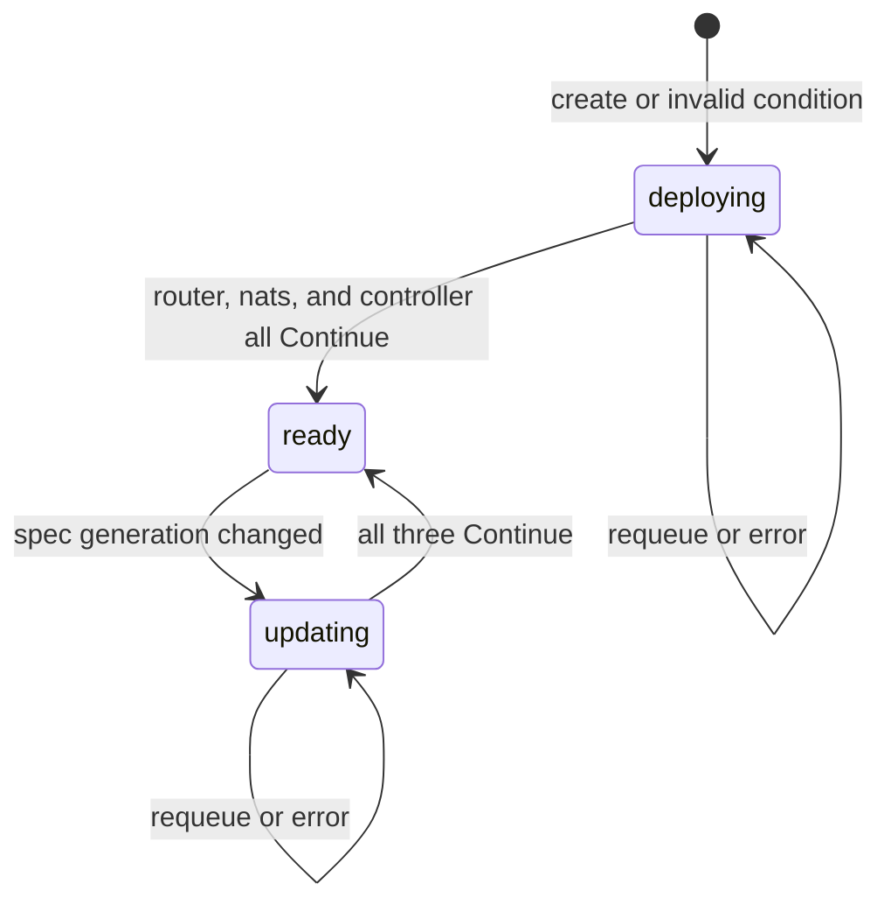
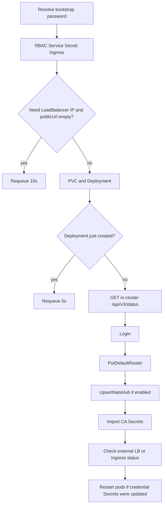

# How the operator works

The ioFog / Datasance operator is a Kubernetes controller. It watches **ControlPlane** custom resources and creates the control-plane workloads in that resource’s namespace: the **Controller** Deployment, the **Router** Deployment, and (unless disabled) the **NATS** StatefulSet, plus Services, Secrets, ConfigMaps, RBAC, an optional Ingress, and an optional SQLite PVC.

It does **not** deploy edge applications, agents, or microservices. Those are created with potctl, iofogctl, or the ioFog Go SDK against the Controller API after this operator has brought the control plane up.

Field-by-field CR reference: [ControlPlane CRD](./controlplane-crd.md). Router and NATS workloads, certificates, and config files: [Router and NATS](./router-and-nats.md). Controller HTTPS, Ingress TLS, and CA import: [Securing the cluster](./securing-cluster.md).

## Process

`main.go` starts a controller-runtime manager:

| Setting | Behavior |
|---------|----------|
| API types | Kubernetes core types plus `ControlPlane` / `ControlPlaneList` |
| Watch | `WATCH_NAMESPACE`. Empty means cluster scope (as documented on the operator). A non-empty value limits the cache to that namespace |
| Leader election | Off unless `--enable-leader-election` is set. ID `iofog.operator` |
| Metrics | `--metrics-addr`, default `:8080` |
| Controllers | One: `ControlPlaneReconciler` |

The reconciler is registered with `For(&ControlPlane{})` only. It does **not** watch Deployments, Secrets, or Services as secondary resources. A reconcile runs when:

- a ControlPlane is created, updated, or deleted
- the reconciler **requeues** itself (LoadBalancer not ready, Controller API not up yet, NATS hub registration retry, and similar)

Owned objects are garbage-collected when the ControlPlane is deleted, because the operator sets an owner reference on the resources it creates. There is no extra finalizer.

While `status` says **ready**, `reconcileReady` returns immediately and does not recreate workloads. The next spec change bumps `metadata.generation`. On the following reconcile the operator treats the object as **updating** and runs the full deploy path again.

## Status machine

`status.conditions` keeps one condition `True`. The type is `deploying`, `updating`, or `ready`.

`GetCondition` implements the ready-to-updating jump: if the `True` condition’s `observedGeneration` is not the object’s current generation, the effective state is `updating` even before status is rewritten.

`deploying` and `updating` run the same three functions in parallel:

1. `reconcileRouter`
2. `reconcileNats` (returns immediately when NATS is disabled)
3. `reconcileIofogController`

Results are combined:

| Any routine returns | Operator does |
|---------------------|----------------|
| Error | Requeue with that error (errors are concatenated) |
| Requeue | Wait the longest requested delay, then reconcile again |
| End | Stop this cycle |
| All `Continue` | Set condition **ready** and update status |

Router and NATS details are in [Router and NATS](./router-and-nats.md). The rest of this page is the Controller path, which also performs Controller API calls that register the router and the NATS hub.

## What Controller reconcile creates

All names are in the ControlPlane namespace. Labels include `app.kubernetes.io/name: iofog`, `app.kubernetes.io/instance: <metadata.name>`, `app.kubernetes.io/component: controller`, `app.kubernetes.io/managed-by: iofog-operator`.

| Kind | Name | When |
|------|------|------|
| ServiceAccount, Role, RoleBinding | `controller` | Always |
| Secret | `controller-db-credentials` | Always. Updated if it already exists |
| Secret | `controller-auth-credentials` | Always. Updated if it already exists |
| Secret | `controller-vault-credentials` | Only when `spec.vault` is configured |
| Service | `controller` | Always |
| Ingress | `controller` | When `spec.services.controller.type` is `ClusterIP` |
| PVC | `controller-sqlite` | When `spec.database.host` is empty |
| Deployment | `controller` | Always. Updated in place when it already exists |

The Controller Role allows the pod to manage ConfigMaps and Services, read Secrets, get/list/watch StatefulSets, and update/patch the StatefulSet named `nats`. That is how the Controller process (not the operator) can adjust NATS after bootstrap. The operator itself uses the service account installed with the operator manifests.

Pod security context is UID/GID/fsGroup **10000**. Image pull policy is `Always`. Replicas default to **1** when `spec.replicas.controller` is 0. More than one replica needs an external database; SQLite uses a recreate strategy and a single PVC.

### Service ports

| Port name | Service port | Pod port |
|-----------|--------------|----------|
| `controller-api` | **51121** | 51121 |
| `console` | **80** | `spec.controller.consolePort`, default **8008** |

Service type defaults to **LoadBalancer** when `spec.services.controller.type` is empty. `externalTrafficPolicy` defaults to `Local` for LoadBalancer and `Cluster` for NodePort. `spec.services.controller.address` is copied to `loadBalancerIP` when set. Annotations on the Service come from `spec.services.controller.annotations`.

### Environment and Secrets

The operator does not pass database passwords or OIDC secrets as plain env values. It writes Secrets and points env vars at keys. The full CR-to-env table is in the [CRD reference](./controlplane-crd.md#cr-field--controller-environment-variables). In short:

| Secret | Keys (representative) | Controller env |
|--------|------------------------|----------------|
| `controller-db-credentials` | `dbname`, `host`, `port`, `username`, `password`, `ssl`, `ca` | `DB_*`, including `DB_USE_SSL` and `DB_SSL_CA` |
| `controller-auth-credentials` | `auth-mode`, bootstrap user/password, issuer, client id/secret | `AUTH_MODE`, `OIDC_*` |
| `controller-vault-credentials` | provider fields | `VAULT_HASHICORP_*`, `VAULT_AWS_*`, … |

`spec.database.ca` is a **base64-encoded PEM** string. The operator copies it unchanged into the Secret key `ca`. See [Database TLS](./controlplane-crd.md#database-tls-and-ca).

Other env is literal: `DB_PROVIDER`, `CONTROL_PLANE=Kubernetes`, `CONTROLLER_NAME`, `CONTROLLER_NAMESPACE`, router and NATS image names (`ROUTER_IMAGE_1`…`4`, `NATS_IMAGE_1`…`4`), `NATS_ENABLED`, `ECN_NAME`, `PID_BASE` (default `/home/runner`), `LOG_LEVEL` (default `info`), plus auth tuning, events, vault, `CONTROLLER_PUBLIC_URL`, `CONSOLE_URL`, `CONSOLE_PORT`, and `TRUST_PROXY`.

When `spec.controller.https` is true, the Deployment also mounts `spec.controller.secretName` at `/etc/iofog/controller-cert/` and sets `TLS_PATH_*`. Readiness then uses `curl` against `https://127.0.0.1:51121/api/v3/status`. Otherwise readiness is an HTTP GET on `/api/v3/status`. See [Securing the cluster](./securing-cluster.md#controller-https).

If `database.host` is empty, a volume mounts PVC `controller-sqlite` at the Controller SQLite directory and the Deployment strategy is **Recreate** instead of rolling update.

### Public URL before the pod is created

`resolveControllerAccess` fills `publicUrl` and `consoleUrl` when they are empty:

| Exposure | Derived `CONTROLLER_PUBLIC_URL` |
|----------|----------------------------------|
| ClusterIP and `ingresses.controller.host` set | `https://<host>` if `controller.https` is true **or** ingress `secretName` is set; otherwise `http://<host>`. `TRUST_PROXY` defaults to true when unset |
| LoadBalancer and the Service already has an address | `{http\|https}://<lb>:51121` (`https` only when `controller.https` is true). Console URL is the same scheme and host without the API port |
| LoadBalancer, no address yet, and `publicUrl` empty | Requeue for **10 seconds**. The Deployment is not created on that pass |

If you set `controller.publicUrl` yourself, the operator uses it and does not wait for a LoadBalancer address.

`updateConsoleClientURLs` runs when a console URL was resolved. The default updater is a no-op; tests can inject a real updater. A failure is logged and does not fail reconcile.

## Controller reconcile, step by step

`reconcileIofogController` always runs this sequence during `deploying` and `updating`.

### 1. Bootstrap password

For `auth.mode: embedded`, the password is `auth.bootstrap.passwordSecretRef` (a Secret in the same namespace) or the inline `auth.bootstrap.password`. External mode does not resolve a bootstrap password here. A missing Secret is a reconcile **error**.

### 2. RBAC, credential Secrets, Service, Ingress

ServiceAccount, Role, and RoleBinding are created if absent. Existing Role and RoleBinding objects are left as they are.

Then:

- **`controller-db-credentials`**, **`controller-auth-credentials`**, and **`controller-vault-credentials`** (if vault is configured) are created, or **updated** when they already exist. An update sets a restart flag used at the end of this reconcile.
- Any other Secrets attached to the controller microservice are created only if missing (`createSecrets` does not overwrite).
- Service `controller` is created or updated (ports, type, annotations, loadBalancer IP).
- If the Service type is **ClusterIP**, Ingress `controller` is created or patched (host, class, TLS secret, annotations, paths `/` → console and `/api/v3` → API). TLS behavior is in [Securing the cluster](./securing-cluster.md#pattern-b-clusterip--ingress-tls).

### 3. Deployment

The PVC (SQLite only) and Deployment are applied. The Deployment spec is updated when it already exists, so image, env, and replica changes land on the next deploying/updating pass.

If the Deployment **did not exist** before this call, reconcile stops and requeues for **5 seconds** so the pod can start before API calls.

### 4. In-cluster health and login

The operator calls `GET {scheme}://controller.<namespace>.svc.cluster.local:51121/api/v3/status`. Scheme is `https` only when `controller.https` is true. Failure requeues for **3 seconds**. This call does not use the public URL; it uses cluster DNS so it works before a LoadBalancer or Ingress is programmed.

Login (`loginIofogClient`):

| `auth.mode` | How |
|-------------|-----|
| `embedded` | Bootstrap username and password via the Controller login API |
| `external` | OAuth2 client-credentials using `auth.issuerUrl` and `auth.client.id` / `auth.client.secret` |

An error whose text contains `invalid credentials` is ignored so a first-boot race can continue. Any other login error fails the reconcile.

### 5. Register router, NATS hub, and CAs

These calls use the same in-cluster client:

1. **`PutDefaultRouter`** — host is the Router Service LoadBalancer address, or `ingresses.router.address`. LoadBalancer waits until an address exists. Missing both is an error. Ports and payload: [Router registration](./router-and-nats.md#registering-the-default-router).
2. **`UpsertNatsHub`** when NATS is enabled and a host is known (NATS LoadBalancer address, or `ingresses.nats.address`). A failed upsert requeues for **10 seconds**. No host means the hub is skipped. Details: [NATS hub registration](./router-and-nats.md#registering-the-nats-hub).
3. **`ImportCertificates`** — `CreateCA` for `router-site-ca`, `default-router-local-ca`, and when NATS is enabled `nats-site-ca` and `default-nats-local-ca`, each as type `k8s-secret`. Already-imported names are skipped. Failure requeues for **10 seconds**. See [Importing CAs](./securing-cluster.md#importing-cas-into-the-controller).

NATS reconcile also calls the Controller earlier, on `GET /api/v3/nats/bootstrap`, to persist JWT and credentials before the StatefulSet starts. That is independent of hub registration. See [NATS bootstrap](./router-and-nats.md#bootstrap-from-the-controller-before-the-statefulset).

### 6. External reachability

| Controller Service type | Check |
|-------------------------|--------|
| `LoadBalancer` | Wait for an address, then `GET` status on that address and port 51121. Not ready yet requeues (requeue **10 seconds**). Status failure requeues **3 seconds** |
| `ClusterIP` | Ingress `controller` must exist and `status.loadBalancer.ingress` must be non-empty. Otherwise the reconcile **errors** (`no LoadBalancer ingress found for Ingress resource`) |

NodePort and other types skip both checks.

### 7. Credential restart

If the DB, auth, or vault Secret **already existed** and was updated in step 2, the operator updates the controller Deployment again (`restartPodsForDeployment`) so pods pick up the new Secret data. Creating those Secrets for the first time does not set the flag.

### 8. Back to the state machine

`Continue` from this function, together with `Continue` from the router and NATS routines, moves status to **ready**.

## Ordering across the three routines

The three goroutines do not wait for each other. Typical first install:

1. Router creates its Service and blocks until it has an address, then writes TLS Secrets and the Deployment.
2. Controller creates its Deployment and requeues for 5 seconds because the Deployment is new. In parallel, NATS tries `GET /nats/bootstrap` and requeues until that API responds.
3. Later passes: Controller logs in, registers the router (needs the router address), registers the NATS hub, imports CAs. NATS writes `server.conf` and the StatefulSet once bootstrap succeeds.
4. When none of the three asks to requeue, status becomes ready.

A ControlPlane can sit in `deploying` for a while on a cloud LoadBalancer. That is the wait in the steps above, not a stuck controller, as long as operator logs show requeue rather than a hard error.

## What a spec change does

1. You change the ControlPlane spec. `metadata.generation` increases.
2. The watch delivers a reconcile. Effective state is `updating` because `observedGeneration` on the ready condition is stale.
3. Router, NATS, and Controller reconcile again.
4. Controller Deployment is updated (image, env, replicas, TLS mount). DB, auth, and vault Secrets are overwritten from the spec. Router TLS Secrets are **not** regenerated if they already exist. NATS `server.conf` **is** rewritten. See [Router and NATS](./router-and-nats.md) for which objects are immutable.
5. Status returns to `ready` with `observedGeneration` set to the new generation.

Editing a Secret directly, without changing the ControlPlane, does **not** by itself schedule a reconcile, because Secrets are not watched. Change the CR when you need the operator to run again.

## Code map

| Topic | Location |
|-------|----------|
| Process and manager | `main.go` |
| Condition selection | `controllers/controlplanes/states.go` |
| Condition helpers | `apis/controlplanes/v3/controlplane_types.go` |
| Controller reconcile | `controllers/controlplanes/reconcile.go` (`reconcileIofogController`) |
| Login | `controllers/controlplanes/k8s.go` (`loginIofogClient`) |
| URL defaults | `controllers/controlplanes/controller_urls.go` |
| Deployment, Service, probes, env | `controllers/controlplanes/microservices.go` |
| Ingress object | `controllers/controlplanes/resources.go` |
