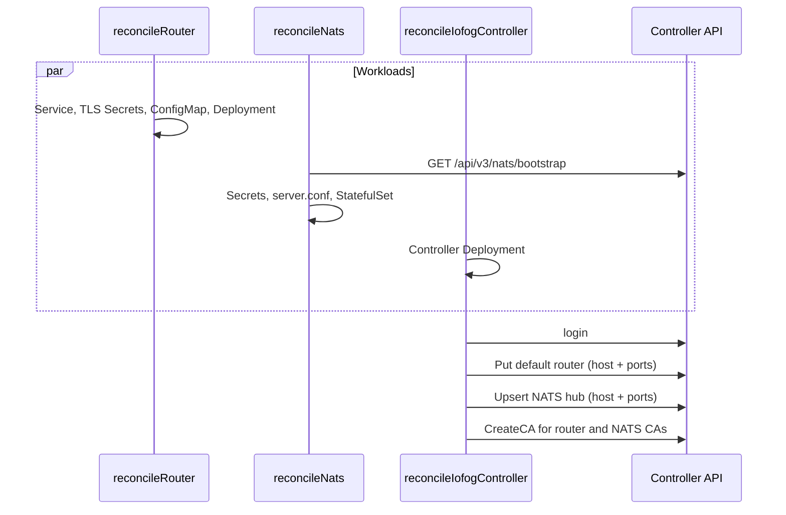

# Router and NATS: workloads, TLS, configuration, and Controller registration

This document describes how the operator creates the **Router** Deployment and the **NATS** StatefulSet, how certificates and configuration files are produced, and how the operator registers the **default router** and the **NATS hub** with the Controller API.

TLS bring-your-own CA, secret immutability, and edge trust are also covered in [Securing the cluster](./securing-cluster.md). This page is the workload-and-config view of the same mechanisms.

CR fields that feed these workloads (`services.router`, `ingresses.router`, `replicas.nats`, `nats.jetStream`, …) are in the [ControlPlane CRD reference](./controlplane-crd.md).

## Where this runs in reconcile

While the ControlPlane condition is `deploying` or `updating`, three reconcilers run **in parallel**:

| Reconciler | Workload | Registers with Controller? |
|------------|----------|----------------------------|
| `reconcileRouter` | Deployment `router`, Service `router`, ConfigMap `iofog-router`, TLS Secrets | No |
| `reconcileNats` | StatefulSet `nats`, Services, ConfigMaps, bootstrap Secrets, TLS Secrets | No (calls Controller only to **read** NATS bootstrap) |
| `reconcileIofogController` | Controller Deployment | **Yes** — default router, NATS hub, and CA import |

The operator process, status machine, and Controller login are in [How the operator works](./operator.md). Registration happens only after the Controller API is reachable and the operator has logged in. Router and NATS pods can exist before registration finishes; edges use the addresses stored in the Controller after registration succeeds.



NATS reconcile exits immediately when `spec.nats.enabled` is `false` (or when NATS is treated as disabled). Omitting `spec.nats` means NATS is **enabled**.

---

## Router

### Kubernetes objects

| Kind | Name | Notes |
|------|------|--------|
| Deployment | `router` | **1** replica. Command: `/home/skrouterd/bin/router` |
| Service | `router` | Type from `spec.services.router.type` (default **LoadBalancer**) |
| ConfigMap | `iofog-router` | Key `skrouterd.json` |
| ServiceAccount / Role / RoleBinding | `router` | Watch pods, configmaps, secrets, services; leases |
| Secrets | see [Certificates](#router-certificates) | |

A second Deployment `router-2` exists in code only when an internal HA flag is true. That flag is **not** wired to the CR (`spec.router` is unused). A standard ControlPlane creates **one** router.

Pod labels include `application: interior-router`, `skupper.io/component: router`, `skupper.io/type: site`, plus operator standard labels. Prometheus annotations scrape port **9090**.

### Service ports

| Service port name | Port | Container | Role |
|-------------------|------|-----------|------|
| `router-message` | **5671** | `amqps` | Messaging (AMQPS) |
| `router-interior` | **55671** | `inter-router` | Inter-router |
| `router-edge` | **45671** | `edge` | Edge listeners |

HTTP health and metrics listen on container port **9090** (`/healthz`). That port is **not** on Service `router`.

### Address required before certificates

`reconcileRouter` creates the Service first, then needs an external hostname or IP for certificate SANs:

| Condition | Address used |
|-----------|----------------|
| `services.router.type` is `LoadBalancer` | LoadBalancer hostname or IP on Service `router` (reconcile waits) |
| Otherwise | `spec.ingresses.router.address` |

If the Service is not a LoadBalancer and `ingresses.router.address` is empty, reconcile fails with `missing Proxy.Router data for non LoadBalancer Router service`.

### Router certificates

The operator looks up these Secrets in the ControlPlane namespace. If any is missing, it generates the missing ones with `GenerateSecret` (RSA 2048, **5 years**, type `kubernetes.io/tls`). If **all four** already exist, it reuses them and does not regenerate.

| Secret | Role | Signed by |
|--------|------|-----------|
| `router-site-ca` | Site CA (self-signed when the operator creates it) | itself |
| `default-router-local-ca` | Local CA (self-signed when the operator creates it) | itself |
| `router-site-server` | Site server cert | `router-site-ca` |
| `router-local-server` | Local server cert | `default-router-local-ca` |

Server certificate subject and SANs:

| Secret | Common name | DNS / IP names |
|--------|-------------|----------------|
| `router-site-server` | `iofog-router` | `router.<namespace>.svc.cluster.local` and the external address |
| `router-local-server` | `iofog-router-local` | same |

Each Secret has `tls.crt`, `tls.key`, and `ca.crt`. For a CA Secret, `ca.crt` is the same as `tls.crt`. For a server Secret, `ca.crt` is the signing CA.

**Bring your own CA:** create `router-site-ca` and/or `default-router-local-ca` (and optionally the server Secrets) **before** reconcile. The operator signs missing server certs with the CA that is already in the cluster. Existing Secrets are not overwritten on later reconciles. Details and rotation: [Securing the cluster — Router TLS](./securing-cluster.md#router-tls-secrets).

The Deployment mounts only the **server** Secrets:

| Volume | Mount path |
|--------|------------|
| Secret `router-site-server` | `/etc/skupper-router-certs/router-site-server` |
| Secret `router-local-server` | `/etc/skupper-router-certs/router-local-server` |
| ConfigMap `iofog-router` | `/tmp/skrouterd.json` (key `skrouterd.json`) |

### Router configuration (`skrouterd.json`)

The operator builds JSON from `controllers/controlplanes/router/config.go` and stores it in ConfigMap **`iofog-router`**, key **`skrouterd.json`**. The container reads it via:

| Env | Value |
|-----|--------|
| `QDROUTERD_CONF` | `/tmp/skrouterd.json` |
| `QDROUTERD_CONF_TYPE` | `json` |
| `SSL_PROFILE_PATH` | `/etc/skupper-router-certs` |
| `SKUPPER_SITE_ID` | `default-router` |
| `SKUPPER_PLATFORM` | `kubernetes` |
| `QDROUTERD_AUTO_MESH_DISCOVERY` | `QUERY` |
| `APPLICATION_NAME` | `router` |
| `POD_NAMESPACE` / `POD_IP` | downward API |

Placeholders in the template are filled with fixed ports and the ControlPlane **namespace** (site `namespace` field). They are **not** taken from `ingresses.router.*` ports. Those ingress ports are used only when **registering** the router with the Controller (next section).

| Config entity | Name | What it does |
|---------------|------|----------------|
| `router` | id `default-router`, mode `interior` | Interior router identity. Metadata includes `"iofog-config": "1.0.0"` |
| `site` | `default-router` | Platform `kubernetes`, namespace = ControlPlane namespace |
| `sslProfile` | `system-default` | System CA bundle `/etc/pki/tls/certs/ca-bundle.crt` |
| `sslProfile` | `router-site-server` | `tls.crt` / `tls.key` / `ca.crt` under `/etc/skupper-router-certs/router-site-server` |
| `sslProfile` | `router-local-server` | same layout under `router-local-server` |
| `listener` | `iofog-router-edge` | role `edge`, port **45671**, sslProfile `router-site-server`, SASL `EXTERNAL`, `authenticatePeer: true` |
| `listener` | `amqp` | host `localhost`, port **5672**, no TLS (in-pod only; not on the Service) |
| `listener` | `amqps` | port **5671**, sslProfile `router-local-server`, SASL `EXTERNAL` |
| `listener` | `@9090` | HTTP health and metrics on **9090** |
| `listener` | `iofog-router-inter-router` | role `inter-router`, port **55671**, sslProfile `router-site-server` |
| `address` | prefix `mc` | multicast distribution |
| `log` | `ROUTER_CORE` | `error+` |

**ConfigMap updates:** if `iofog-router` already exists, the operator merges. Entries of type `router`, `site`, `address`, and `log` are replaced from the new template. `sslProfile` and `listener` entries are replaced only when their names match the table above. Other existing entries are kept. If metadata `iofog-config` versions match, the existing document is left unchanged.

### Registering the default router

This runs in **controller** reconcile, not in router reconcile, after login.

The operator chooses a proxy and calls the Controller client **`PutDefaultRouter`** (default-router API). Payload:

| API field | Source |
|-----------|--------|
| `host` | LoadBalancer address of Service `router`, **or** `spec.ingresses.router.address` |
| messaging port | LoadBalancer path: **5671**. Ingress path: `ingresses.router.messagePort` (0 means the API receives 0; set the port explicitly when using ingress) |
| inter-router port | LoadBalancer: **55671**. Ingress: `ingresses.router.interiorPort` |
| edge port | LoadBalancer: **45671**. Ingress: `ingresses.router.edgePort` |

Sample CR comments use `5671` / `55671` / `45671` for the ingress block so the registered ports match the listeners in `skrouterd.json`.

Edges and tools then learn the router endpoint from the Controller, not by reading the Kubernetes Service directly.

---

## NATS

### Kubernetes objects

| Kind | Name | Notes |
|------|------|--------|
| StatefulSet | `nats` | `serviceName: nats-headless`. Replicas = `spec.replicas.nats`, minimum **2** |
| Service | `nats-headless` | `ClusterIP: None`. All NATS ports. Pod DNS `nats-0.nats-headless`, `nats-1.nats-headless`, … |
| Service | `nats` | Type from `spec.services.nats` (reconcile default **LoadBalancer** if type is empty). Ports: cluster, leaf, mqtt |
| Service | `nats-server` | Type from `spec.services.natsServer`. Ports: **client** and **monitor** only |
| ConfigMap | `iofog-nats-config` | Key `server.conf` |
| ConfigMap | `iofog-nats-jwt-bundle` | Account JWT files |
| PVC template | `js-data` | JetStream file store. Default size **10Gi** |
| ServiceAccount / Role / RoleBinding | `nats` | get/list/watch configmaps and secrets |

Run-as user/group/fsGroup is **10000**.

### Ports

| Name | Port | Where it is exposed |
|------|------|---------------------|
| client | **4222** | Headless and `nats-server`. Not on Service `nats` |
| cluster | **6222** | Headless and Service `nats` |
| leaf | **7422** | Headless and Service `nats` |
| mqtt | **8883** | Headless and Service `nats` |
| monitor | **8222** | Headless and `nats-server`. HTTP `/healthz?js-enabled-only=true` |

These ports are compiled into the NATS container env and into `server.conf`. `spec.ingresses.nats.*Port` does **not** change the in-cluster listeners. Those fields are used when **registering the hub** (and the leaf **advertise** host:port uses the ingress leaf port when it is greater than 0).

### Bootstrap from the Controller (before the StatefulSet)

NATS reconcile talks to the Controller **inside the cluster**:

`http(s)://controller.<namespace>.svc.cluster.local:51121`

Scheme is `https` only when `spec.controller.https` is true. It logs in, then calls **`GET /api/v3/nats/bootstrap`**. The Controller creates operator JWT, system account, and hub system-user credentials. The operator only **stores** the response:

| Secret | Contents |
|--------|----------|
| `nats-operator-seed` | key `seed` — operator seed from the API |
| `nats-creds-sys-admin-hub` | key `admin-hub.creds` — base64-decoded creds file |

The operator JWT and system-account public key are written into `server.conf` and the JWT ConfigMap (below). They are not a separate “JWT secret”.

JetStream encryption key Secret **`nats-jetstream-key-<controlplane-name>`**, key **`jsk`**: 32 random bytes, base64-encoded. Created once; reused if `jsk` is already present. Mounted at `/etc/nats/jetstream` and also injected as env `JETSTREAM_KEY`. `JETSTREAM_PREV_KEY` is empty on first install.

If the Controller is not ready yet, NATS reconcile requeues. That is expected while the three reconcilers run together.

### NATS certificates

Checked independently. A missing Secret is generated; an existing Secret is left as-is.

| Secret | Role | Signed by |
|--------|------|-----------|
| `nats-site-ca` | Site CA | self-signed when generated |
| `default-nats-local-ca` | Local CA | self-signed when generated |
| `nats-site-server` | Client, cluster, and leaf TLS | `nats-site-ca` |
| `nats-mqtt-server` | MQTT TLS | `default-nats-local-ca` |

Common names: `iofog-nats` (site server), `iofog-nats-mqtt` (MQTT).

SANs (same list for both server certs) include:

- `nats-0.nats-headless`, `nats-1.nats-headless`, … for each replica
- `*.nats-headless.<namespace>.svc.cluster.local`
- `nats.<namespace>.svc.cluster.local`
- `nats-server.<namespace>.svc.cluster.local`
- the external address when known (LoadBalancer host of Service `nats`, or `ingresses.nats.address`)

Server Secrets are annotated `datasance.com/nats-replicas`. If `spec.replicas.nats` changes, the operator **deletes** `nats-site-server` and `nats-mqtt-server` and recreates them so SANs match the new replica count. CA Secrets are not deleted.

External address for SANs:

| Condition | Address |
|-----------|---------|
| `services.nats.type` is `LoadBalancer` | LB address of Service `nats` |
| `ingresses.nats.address` is set | that hostname |
| neither | SANs are in-cluster names only; hub registration is skipped later if address is still empty |

Bring-your-own CA uses the same secret names. See [Securing the cluster — NATS TLS](./securing-cluster.md#nats-tls-secrets).

Mounts:

| Volume | Mount |
|--------|--------|
| Secret `nats-site-server` | `/etc/nats/certs/nats-site-server` |
| Secret `nats-mqtt-server` | `/etc/nats/certs/nats-mqtt-server` |
| ConfigMap `iofog-nats-config` | `/etc/nats/config` |
| ConfigMap `iofog-nats-jwt-bundle` | `/tmp/nats/jwt` |
| Secret `nats-creds-sys-admin-hub` | `/etc/nats/creds/admin-hub.creds` |
| PVC `js-data` | `/home/runner/data` |

### NATS configuration (`server.conf`)

ConfigMap **`iofog-nats-config`**, key **`server.conf`**, is **rewritten on every NATS reconcile** so replica routes stay current. Container env `NATS_CONF=/etc/nats/config/server.conf`.

`$SELFNAME` is left in the file. Env `SELFNAME` is the pod name (`metadata.name`), and the NATS image substitutes it so each replica has a distinct `server_name`.

| `server.conf` setting | Value the operator writes |
|-----------------------|---------------------------|
| `port` | 4222 |
| `http_port` | 8222 |
| `operator` | Operator JWT from bootstrap |
| `system_account` | System account public key from bootstrap |
| `jetstream.store_dir` | `/home/runner/data` |
| `jetstream.domain` | ControlPlane **namespace** |
| `jetstream.max_memory_store` | `spec.nats.jetStream.memoryStoreSize`, default **1G** (NATS units; `1Gi` in the CR becomes `1G`) |
| `jetstream.max_file_store` | storage size, default **10G**. PVC uses Kubernetes units (default **10Gi**) |
| `jetstream.cipher` / `key` | `chachapoly` and the `jsk` secret value |
| `cluster.name` | ControlPlane **metadata.name** |
| `cluster.port` | 6222 |
| `cluster.no_advertise` | `true` |
| `cluster.routes` | `nats://nats-<i>.nats-headless:6222` for each replica, **plus** any non-ordinal routes already in the ConfigMap (for example routes the Controller added for agents). Operator ordinals are replaced, not duplicated |
| `cluster.tls` | files under `/etc/nats/certs/nats-site-server` (`ca.crt`, `tls.crt`, `tls.key`), `verify: true`, `handshake_first: true` |
| `leafnodes.port` | 7422 |
| `leafnodes.advertise` | `<external-address>:<leafPort>` when an external address exists. `leafPort` is `ingresses.nats.leafPort` if &gt; 0, otherwise **7422**. Omitted when there is no external address |
| `leafnodes.tls` | same site server cert as cluster |
| `mqtt.port` | 8883 |
| `mqtt.tls` | `/etc/nats/certs/nats-mqtt-server` (local CA) |
| `resolver` | `type: full`, `dir: /home/runner/nats/jwt`, interval `2m` |

JWT bundle ConfigMap **`iofog-nats-jwt-bundle`**: one key `<systemAccountPublicKey>.jwt` whose value is the system account JWT from bootstrap. Created if missing; an existing ConfigMap is not replaced on the create path (`AlreadyExists` is ignored).

Relevant container env (fixed by the operator, not CR fields):

| Env | Value |
|-----|--------|
| `NATS_SERVER_MODE` | `server` |
| `NATS_JWT_DIR` | `/home/runner/nats/jwt` |
| `NATS_JWT_MOUNT_DIR` | `/tmp/nats/jwt` |
| `NATS_TLS_DIR` | `/etc/nats/certs` |
| `NATS_CERT_NAME` | `nats-site-server` |
| `NATS_MQTT_CERT_NAME` | `nats-mqtt-server` |
| `NATS_SYS_USER_CRED_PATH` | `/etc/nats/creds/admin-hub.creds` |
| `JETSTREAM_KEY` | from Secret key `jsk` |

**Scale-down:** if the live StatefulSet has more replicas than desired, the operator sets pod annotation `kubectl.kubernetes.io/restartedAt` so NATS restarts and drops removed cluster routes. Scale-up does not add that annotation.

### Registering the NATS hub

This runs in **controller** reconcile when NATS is enabled, after the default router is registered.

The operator calls **`UpsertNatsHub`**. Host:

| Condition | Host |
|-----------|------|
| `services.nats.type` is `LoadBalancer` | LB address of Service `nats` (waits until assigned) |
| otherwise | `spec.ingresses.nats.address` |

If the host is still empty, the hub is **not** registered (in-cluster-only NATS with no ingress address).

Ports sent to the API (0 in the CR is replaced by the default):

| Field | Default |
|-------|---------|
| server | 4222 |
| cluster | 6222 |
| leaf | 7422 |
| mqtt | 8883 |
| http (monitor) | 8222 |

When using ingress, set `ingresses.nats` to the hostname and ports that **external** clients use. Those values are what the Controller stores for agents. They do not retarget the Kubernetes Service ports.

### Importing CAs into the Controller

After hub registration, controller reconcile imports CA Secrets so the Controller catalog can hand trust material to agents. Each call is `CreateCA` with `type: k8s-secret` and `secretName` equal to the Secret name, only if `GetCA` returns not found.

| Secret imported | When |
|-----------------|------|
| `router-site-ca` | always |
| `default-router-local-ca` | always |
| `nats-site-ca` | NATS enabled |
| `default-nats-local-ca` | NATS enabled |

The Controller reads the Secret in the ControlPlane namespace. This is the link between the certificates mounted on Router/NATS and the CA list agents receive. See [Securing the cluster — Importing CAs](./securing-cluster.md#importing-cas-into-the-controller).

---

## How the pieces line up

```text
Router pod
  skrouterd.json  -> listeners 5671 / 45671 / 55671 + sslProfiles
  Secrets         -> router-site-server, router-local-server
  Service router  -> same three ports to the outside
        |
        +--> PutDefaultRouter(host, ports) on Controller
        +--> CreateCA(router-site-ca, default-router-local-ca)

NATS pod nats-0 / nats-1
  server.conf     -> ports, JWT, JetStream, cluster routes, TLS paths
  Secrets         -> nats-site-server, nats-mqtt-server, creds, jetstream key
  Service nats    -> 6222 / 7422 / 8883 (and LB or ingress host for advertise + hub)
  Service nats-server -> 4222 / 8222
        |
        +--> GET /nats/bootstrap (operator stores JWT and creds)
        +--> UpsertNatsHub(host, ports) on Controller
        +--> CreateCA(nats-site-ca, default-nats-local-ca)
```

---

## Code map

| Topic | Location |
|-------|----------|
| Router reconcile order | `controllers/controlplanes/reconcile.go` (`reconcileRouter`) |
| Router JSON template | `controllers/controlplanes/router/config.go` |
| Router ConfigMap merge | `controllers/controlplanes/k8s.go` (`createConfigMap`, `mergeConfigs`) |
| Router Deployment volumes and env | `controllers/controlplanes/microservices.go` (`newRouterMicroservice`) |
| `PutDefaultRouter` | `controllers/controlplanes/k8s.go` (`createDefaultRouter`) |
| NATS reconcile | `controllers/controlplanes/reconcile.go` (`reconcileNats`) |
| `server.conf` template | `controllers/controlplanes/nats/config.go` |
| TLS Secret generation | `controllers/controlplanes/nats/certs.go` |
| Bootstrap persistence | `controllers/controlplanes/nats/bootstrap.go` |
| Hub upsert | `controllers/controlplanes/k8s.go` (`createDefaultNatsHub`) |
| CA import | `controllers/controlplanes/reconcile.go` (`ImportCertificates`) |
