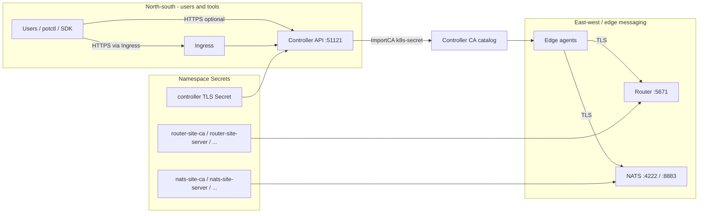
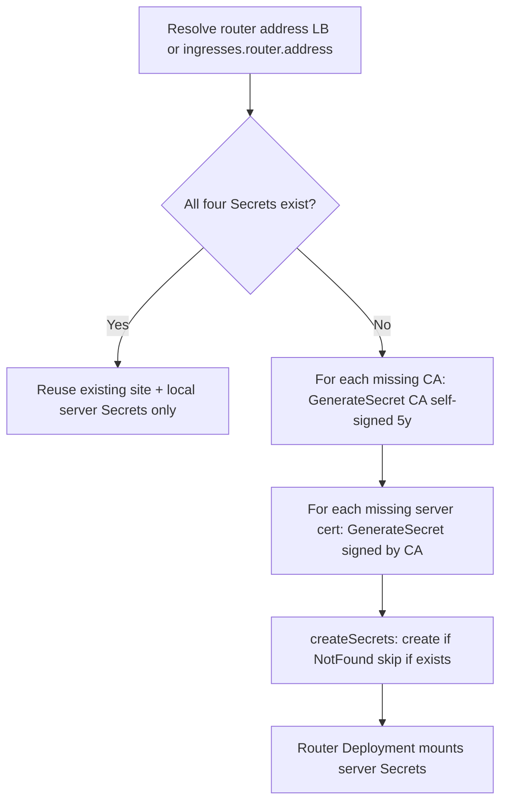

# Securing the control plane cluster

This guide explains how TLS and certificate authorities (CAs) work for the **Controller**, **Router**, and **NATS** when managed by the ioFog / Datasance PoT operator. It covers:

- HTTPS for the Controller using a **pod-mounted TLS Secret** or **Ingress**
- **Self-signed CA generation** vs **bring-your-own CA** for Router and NATS
- **CA import** into the Controller API
- **Edge agents** trusting those CAs (conceptual)
- **cert-manager** and **nginx** examples

For CR field defaults and URL derivation, see [ControlPlane CRD reference](./controlplane-crd.md). For how those Secrets are mounted, how `skrouterd.json` and `server.conf` are built, and how the operator registers the router and NATS hub, see [Router and NATS](./router-and-nats.md).

---

## Database TLS (`spec.database.ca`)

External database TLS is configured on the ControlPlane CR, not via Kubernetes TLS Secrets in this namespace.

| CR field | Controller env | Meaning |
|----------|----------------|---------|
| `database.ssl` | `DB_USE_SSL` | Enable TLS to the DB server |
| `database.ca` | `DB_SSL_CA` | **Base64-encoded PEM** of the CA used to verify the DB server certificate (private or custom CA) |

The operator **passes `ca` through unchanged** (Secret `controller-db-credentials`, key `ca`). It does not base64-decode at reconcile time; the **Controller** decodes `DB_SSL_CA` when connecting.

This is separate from:

- Controller HTTPS (`controller.https` / Ingress TLS)
- Router Secrets (`router-site-ca`, …)
- NATS Secrets (`nats-site-ca`, …)

See [ControlPlane CRD — Database TLS and `ca`](./controlplane-crd.md#database-tls-and-ca) for encoding examples and when to set each field.

---

## Security model at a glance



| Layer | Who terminates TLS? | Who creates certificates? |
|-------|---------------------|-----------------------------|
| Controller (LB) | Controller pod | **You** (Secret referenced by `controller.secretName`) |
| Controller (Ingress) | Usually Ingress controller | **You** or **cert-manager** (Ingress TLS Secret) |
| Router | Router pod (Skupper) | **Operator** (default) or **you** (pre-created Secrets) |
| NATS | NATS pod | **Operator** (default) or **you** (pre-created Secrets) |

The operator **never** generates TLS certificates for the Controller HTTP API. It **does** generate Router and NATS material when named Secrets are missing.

---

## Controller HTTPS

### TLS Secret format (pod mount)

When `spec.controller.https: true`, the operator:

1. Mounts Secret `spec.controller.secretName` at **`/etc/iofog/controller-cert/`**
2. Sets environment variables:

| Variable | Value |
|----------|--------|
| `SERVER_DEV_MODE` | `false` |
| `TLS_PATH_CERT` | `/etc/iofog/controller-cert/tls.crt` |
| `TLS_PATH_KEY` | `/etc/iofog/controller-cert/tls.key` |
| `TLS_PATH_INTERMEDIATE_CERT` | `/etc/iofog/controller-cert/ca.crt` |

Expected Secret type: **`kubernetes.io/tls`** with keys:

| Key | Content |
|-----|---------|
| `tls.crt` | Server certificate (and optionally chain) |
| `tls.key` | Private key |
| `ca.crt` | Intermediate or root for clients that need it (optional but recommended) |

Readiness probe uses **`curl -sfk`** against `https://127.0.0.1:51121/api/v3/status` when HTTPS is enabled.

### Pattern A: LoadBalancer + pod TLS

Use when the cloud LoadBalancer forwards **TCP** to the Controller Service ports and the Controller terminates TLS.

```yaml
spec:
  services:
    controller:
      type: LoadBalancer
  controller:
    https: true
    secretName: controller-api-tls
    publicUrl: https://203.0.113.10:51121   # or your LB hostname
```

Create the Secret **before** or **after** the ControlPlane exists (same namespace as the CR):

```bash
kubectl create secret tls controller-api-tls \
  --cert=fullchain.pem \
  --key=privkey.pem \
  -n iofog
# If you need ca.crt in the Secret for the Controller env path:
kubectl patch secret controller-api-tls -n iofog --type='json' \
  -p='[{"op":"add","path":"/data/ca.crt","value":"'$(base64 -w0 ca.pem)'"}]'
```

**Derived URLs:** If `publicUrl` is empty, the operator waits for the LoadBalancer address and sets:

- `CONTROLLER_PUBLIC_URL` → `https://<lb>:51121`
- `CONSOLE_URL` → `https://<lb>` (port 443 implied in URL; console Service is port 80 → pod `consolePort`)

Ensure the certificate **SANs** include the hostname or IP clients use.

### Pattern B: ClusterIP + Ingress TLS

Use when an **Ingress controller** terminates TLS and routes to the Controller Service inside the cluster.

**Requirements:**

- `spec.services.controller.type: ClusterIP`
- `spec.ingresses.controller.host` set (non-empty)

The operator creates Ingress **`controller`** with:

| Path | Backend Service port |
|------|----------------------|
| `/` | `console` (Service port 80 → pod console) |
| `/api/v3` | `controller-api` (51121) |

```yaml
spec:
  services:
    controller:
      type: ClusterIP
  ingresses:
    controller:
      host: controller.example.com
      ingressClassName: nginx
      secretName: controller-tls
      annotations:
        cert-manager.io/cluster-issuer: letsencrypt-prod
  controller:
    publicUrl: https://controller.example.com
    trustProxy: true
    https: false          # Ingress terminates TLS (typical)
    secretName: ""        # not used when https is false
```

**URL derivation:** With Ingress mode, if `publicUrl` is omitted the operator sets `https://<host>` when `ingresses.controller.secretName` is set, otherwise `http://<host>`. If `trustProxy` is omitted, the operator defaults it to **`true`**.

#### B1 — Ingress terminates TLS, Controller speaks HTTP

- `controller.https: false`
- Ingress holds the public certificate (`controller-tls`).
- nginx forwards plain HTTP to the pod.

Example annotations:

```yaml
ingresses:
  controller:
    annotations:
      cert-manager.io/cluster-issuer: letsencrypt-prod
      nginx.ingress.kubernetes.io/proxy-buffer-size: "128k"
```

No `backend-protocol` annotation is required (default HTTP to backend).

#### B2 — Ingress terminates TLS and Controller also uses HTTPS (re-encrypt)

- `controller.https: true`
- `controller.secretName` must mount a cert the **Ingress trusts** (often same SAN, internal CA, or shared cert).
- Ingress must use HTTPS to the backend:

```yaml
ingresses:
  controller:
    annotations:
      nginx.ingress.kubernetes.io/backend-protocol: "HTTPS"
controller:
  https: true
  secretName: controller-api-tls
```

Clients still hit `https://controller.example.com` on the Ingress. The path is: **Client → TLS → Ingress → TLS → Controller pod**.

#### cert-manager Certificate (Ingress TLS)

```yaml
apiVersion: cert-manager.io/v1
kind: Certificate
metadata:
  name: controller-tls
  namespace: iofog
spec:
  secretName: controller-tls
  issuerRef:
    name: letsencrypt-prod
    kind: ClusterIssuer
  dnsNames:
    - controller.example.com
```

Reference `secretName: controller-tls` in `spec.ingresses.controller.secretName`.

### Pattern comparison

| Aspect | LB + pod TLS | Ingress TLS (B1) | Ingress + pod TLS (B2) |
|--------|--------------|------------------|-------------------------|
| `controller.https` | `true` | `false` | `true` |
| Public cert location | Pod Secret | Ingress Secret | Both |
| `trustProxy` | Usually false | true (auto if unset) | true |
| Operator waits on | LB Service | Ingress `.status.loadBalancer` | Ingress LB status |

**Ingress readiness:** For ClusterIP Controller Service, reconcile expects Ingress **`status.loadBalancer.ingress`** to be populated (depends on your ingress controller exposing external status).

---

## Router TLS secrets

The Router (Skupper interior router) mounts:

| Mount path | Secret name |
|------------|-------------|
| `/etc/skupper-router-certs/router-site-server` | `router-site-server` |
| `/etc/skupper-router-certs/router-local-server` | `router-local-server` |

Site certificates are signed by **`router-site-ca`**. Local server certificates are signed by **`default-router-local-ca`** (the “local CA”).

### Secret names the operator checks

Before generating anything, `createRouterSecrets` **GETs** these Secrets in the **ControlPlane namespace**:

| Secret name | Role |
|-------------|------|
| `router-site-ca` | Site CA (self-signed if created by operator) |
| `default-router-local-ca` | Local CA (self-signed if created by operator) |
| `router-site-server` | Site server cert + key + `ca.crt` |
| `router-local-server` | Local server cert + key + `ca.crt` |

### Generation flow



**Short-circuit:** If **all four** Secrets already exist, the operator **only** attaches the two **server** Secrets to the Router Deployment and **does not** regenerate CAs or servers.

**Partial pre-provision:** If you create only the CAs (or only some Secrets), the operator generates **missing** entries. Server cert SANs include:

- `router.<namespace>.svc.cluster.local`
- External **address** (LoadBalancer hostname/IP or `ingresses.router.address`)

Common name subjects: `iofog-router` (site), `iofog-router-local` (local).

### Bring your own Router CA

1. Create **`router-site-ca`** and/or **`default-router-local-ca`** as `kubernetes.io/tls` Secrets with **CA** key usage (operator uses `tls.crt` / `tls.key` as CA when signing).
2. Optionally pre-create **`router-site-server`** and **`router-local-server`** with correct SANs; otherwise the operator creates them signed by your CAs.
3. Apply **before** first successful Router reconcile, or ensure missing pieces are created in the same reconcile pass.

**Important:** Once a Secret exists, the operator **will not update** it on later reconciles (`createSecrets` skips existing Secrets). To rotate, delete the Secret and let the operator recreate it (plan for Router restart).

### Other Router secret names (constants)

The reconcile code references additional Skupper secret names (`skupper-local-client`, `skupper-console-certs`, etc.) for a full Skupper deployment; the operator’s `createRouterSecrets` path documented here focuses on the **four** Secrets above that gate TLS for the ioFog Router pod.

---

## NATS TLS secrets

NATS TLS is aligned with Controller `nats-service.js` naming.

### Secret names the operator checks

`EnsureNatsSecrets` checks each Secret **independently**:

| Secret name | Role |
|-------------|------|
| `nats-site-ca` | Site CA |
| `default-nats-local-ca` | Local CA (MQTT/local signing) |
| `nats-site-server` | NATS client/cluster/leaf TLS |
| `nats-mqtt-server` | MQTT TLS (signed by **local** CA) |

If a Secret is **NotFound**, the operator generates it. Existing Secrets are left unchanged.

### Certificate contents

- **CAs:** `GenerateSecret` with no parent CA → **self-signed** CA, validity **5 years**, type `kubernetes.io/tls`.
- **Server certs:** Signed by site or local CA; SANs include per-pod DNS (`nats-0.nats-headless`, …), cluster Service names, wildcard headless domain, and external **address** when known (LB or `ingresses.nats.address`).
- Annotations on server Secrets: `datasance.com/nats-replicas: "<count>"`.

### Replica count and rotation

When `spec.replicas.nats` changes, the operator **deletes** `nats-site-server` and `nats-mqtt-server` if the replica annotation is stale, then recreates them with updated SANs. **CA Secrets are not deleted** automatically.

### NATS address for SANs and hub registration

| Exposure | Address source |
|----------|----------------|
| `services.nats.type: LoadBalancer` | LB hostname/IP of Service `nats` |
| Otherwise | `ingresses.nats.address` (required for external TLS validation) |

Hub registration uses the same address/ports (`createDefaultNatsHub`); port defaults match [CRD reference](./controlplane-crd.md#ingressesnats).

### Bring your own NATS CA

Same pattern as Router:

1. Pre-create `nats-site-ca` and/or `default-nats-local-ca`.
2. Optionally pre-create server Secrets; operator fills gaps.
3. Use `kubernetes.io/tls` with `tls.crt`, `tls.key`, and for leaf certs `ca.crt` pointing to signing CA.

---

## Self-signed CA generation (implementation)

All operator-generated certificates use `internal/util/certs.GenerateSecret`:

| Parameter | Behavior |
|-----------|----------|
| Expiration `0` | **5 years** |
| Key | RSA **2048** |
| CA generation | `ca == nil` → template is CA, self-signed |
| Leaf generation | Signed by parent CA from Secret `tls.crt` / `tls.key` |
| Secret keys | `tls.crt`, `tls.key`, `ca.crt` (for leaves, copy of CA cert) |

**Panic risk:** Invalid PEM in an existing CA Secret can cause generation to fail fatally during reconcile—validate PEM when bringing your own CA.

---

## Importing CAs into the Controller

After the Controller API is reachable and the operator is logged in, **`ImportCertificates`** registers CAs with the Controller:

| Kubernetes Secret name | Imported when |
|------------------------|---------------|
| `router-site-ca` | Always |
| `default-router-local-ca` | Always |
| `nats-site-ca` | NATS enabled |
| `default-nats-local-ca` | NATS enabled |

API call (conceptually):

```json
{
  "name": "<secret-name>",
  "type": "k8s-secret",
  "secretName": "<secret-name>"
}
```

The Controller reads the CA material from the **same namespace** as the ControlPlane. If `GetCA` returns not found, the operator calls **`CreateCA`**. Existing CAs are not recreated.

This catalog is what downstream **edge** components use when connecting to Router/NATS with operator-issued or custom CAs.

---

## Edge agents and trust (high level)

Edge agents (Edgelet) and tools such as **potctl** / **iofogctl** connect to:

- **Controller** at `CONTROLLER_PUBLIC_URL` / configured API URL (HTTPS when you enable it)
- **Router** messaging port (**5671**, TLS)
- **NATS** (client **4222**, MQTT **8883**, etc.) when hubs are used

**Trust chain:**

1. For **Controller HTTPS**, clients must trust the **public** certificate (Let’s Encrypt, corporate CA, or explicit `--insecure` in dev).
2. For **Router/NATS**, clients typically trust CAs **imported into the Controller** (site/local CA Secrets above). Provisioning flows distribute agent configuration referencing those CAs.
3. If you replace self-signed CAs with **enterprise CAs**, pre-create the four Router / four NATS Secrets (or CAs + let operator sign leaves), then verify CAs appear in the Controller CA API and re-provision or update agents as required by your Edgelet version.

Consult Edgelet / agent documentation for exact certificate bundle paths and rotation procedures for your release.

---

## Operational checklist

### Controller

- [ ] Choose Pattern A (LB + pod TLS) or B (Ingress).
- [ ] Set `publicUrl` / `consoleUrl` to match what browsers and CLI use.
- [ ] For Ingress: set `trustProxy: true` when behind a reverse proxy.
- [ ] For embedded OIDC: use `passwordSecretRef` instead of inline bootstrap password in Git.
- [ ] For external DB with private CA: `database.ssl: true` and `database.ca` as base64(PEM) — not the same as Ingress or Router TLS Secrets.

### Router / NATS

- [ ] Decide: operator self-signed vs corporate CA.
- [ ] If BYO: create CA Secrets **before** reconcile or accept one-time generation order.
- [ ] Ensure external **address** in cert SANs matches what edges use (LB DNS or ingress hostname).
- [ ] Plan rotation: delete stale Secrets to regenerate; restart Router/NATS pods.

### Namespace hygiene

- [ ] Restrict RBAC on the ControlPlane namespace (Secrets contain DB, auth, and private keys).
- [ ] Do not commit CRs with plaintext `database.password` or `auth.bootstrap.password` to Git.

---

## Troubleshooting

| Symptom | Likely cause |
|---------|----------------|
| Controller stuck deploying, Ingress mode | Ingress has no `status.loadBalancer.ingress` |
| `missing Proxy.Router data for non LoadBalancer Router service` | Router not LB and `ingresses.router.address` empty |
| HTTPS works in cluster but not externally | Wrong SAN on cert; wrong `publicUrl` |
| OIDC redirect HTTP/HTTPS mismatch | `publicUrl` scheme vs actual entrypoint; set `trustProxy` |
| NATS hub not registered | NATS enabled but no LB address and empty `ingresses.nats.address` |
| Import CA failures | Controller not ready; login failure; Secret missing or wrong namespace |
| Router TLS errors after hostname change | Server Secrets not regenerated—delete `router-site-server` / `router-local-server` and reconcile |

---

## Quick reference — TLS Secret names

| Component | Secret names |
|-----------|----------------|
| Controller pod TLS | `spec.controller.secretName` (user chosen) |
| Ingress TLS | `spec.ingresses.controller.secretName` |
| Router | `router-site-ca`, `default-router-local-ca`, `router-site-server`, `router-local-server` |
| NATS | `nats-site-ca`, `default-nats-local-ca`, `nats-site-server`, `nats-mqtt-server` |

---

## Code references

| Topic | File |
|-------|------|
| Controller TLS mount | `controllers/controlplanes/microservices.go` |
| Ingress | `controllers/controlplanes/resources.go`, `k8s.go` |
| Router secrets | `controllers/controlplanes/reconcile.go` (`createRouterSecrets`) |
| NATS secrets | `controllers/controlplanes/nats/certs.go` |
| CA import | `controllers/controlplanes/reconcile.go` (`ImportCertificates`), `k8s.go` (`ImportRouterCACertificate`) |
| Cert generation | `internal/util/certs/certs.go` |
